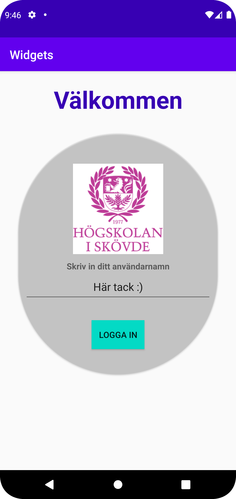

# Rapport

Jag valde att behålla den förinlagda constraintlayouten i denna uppgift. Alla komponenter läggs till på appens startskärm och koden som läggs till finns i filen activity_main.xml. 

En TextView placerades som en header med en välkomsttext. Positioneringen justerades med att sätta constraints och med en marginal. Extra styling av texten lades till för ökat fokus. Se Figur 1 för förtydligande av beskriven implementation.    
Figur 1
```
<TextView
        android:id="@+id/header"
        android:layout_width="match_parent"
        android:layout_height="wrap_content"
        android:text="Välkommen"
        android:layout_marginTop="20dp"
        android:textSize="40sp"
        android:textStyle="bold"
        android:textColor="@color/colorPrimaryDark"
        android:textAlignment="center"
        app:layout_constraintTop_toTopOf="parent"
        app:layout_constraintStart_toStartOf="parent"/>
```

Inuti constraintlayouten placerades en widget CardView, med begränsningen (constraint) till att positioneras under komponenten med idet "header" (Se figur 2 för förtydligande). 
Denna skapades för att samla ihop flera komponenter som hör ihop och dessa skapas senare i uppgiften.
Figur 2
```
    <androidx.cardview.widget.CardView
        android:id="@+id/card_layout"
        android:layout_width="match_parent"
        android:layout_height="400dp"
        android:layout_margin="30dp"
        app:cardCornerRadius="200dp"
        app:cardBackgroundColor="@color/cardview_shadow_end_color"
        app:layout_constraintStart_toStartOf="parent"
        app:layout_constraintTop_toBottomOf="@+id/header" >
                <androidx.constraintlayout.widget.ConstraintLayout
                    android:id="@+id/card_body"
                    android:layout_width="match_parent"
                    android:layout_height="match_parent">
```

Inuti constraintlayouten med idet "card-body" placerades en bildelement (ImageView). Denna bild är hämtad från his.se och inlagd i filen drawable. 
Här är positioneringen satt med hjälp av constraints till att vara i mitten av föräldrakomponenten horisontellt och vertikalt placerad till toppen av föräldrakomponenten. 
Marginalen som är satt gör så att bilden skjuts ner vertikalt så att bilden hamnar en bit ner från vart den är begränsad till. 
Figur 3
```
    <ImageView
        android:id="@+id/imageView"
        android:layout_width="150dp"
        android:layout_height="150dp"
        android:layout_margin="50dp"
        app:srcCompat="@drawable/his_se_logo_web"
        android:contentDescription="his logo"
        app:layout_constraintTop_toTopOf="parent"
        app:layout_constraintStart_toStartOf="parent"
        app:layout_constraintEnd_toEndOf="parent"/>
```

## Skärmbild från appen


